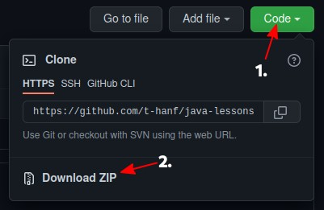
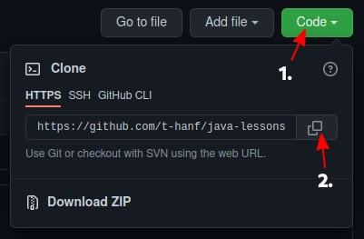

# Java lessons code
This repository contains the code used in the Java course of the WS 21/22.\
 The directory `exercises` contains the sample solutions for these [exercises](https://course.tobias-hanf.de).\
  The directory `lessons` contains the code used or create during the lessons.

## Getting the code
### Downloading as a ZIP

1. On the [github page](https://github.com/t-hanf/java-lessons-code) click on the green **Code** button.
2. Click on **Download ZIP**
3. Save the file
4. Unzip the file

### Cloning the repository

For this to work you need a **git** client

1. On the [github page](https://github.com/t-hanf/java-lessons-code) click on the green **Code** button.
2. Click the copy button. This will copy the link to the repo.
3. In your **git** client clone this repository (for the normal git client: `git clone https://github.com/t-hanf/java-lessons-code.git`)
4. To update your local copy **pull** the repository (`git pull`)

